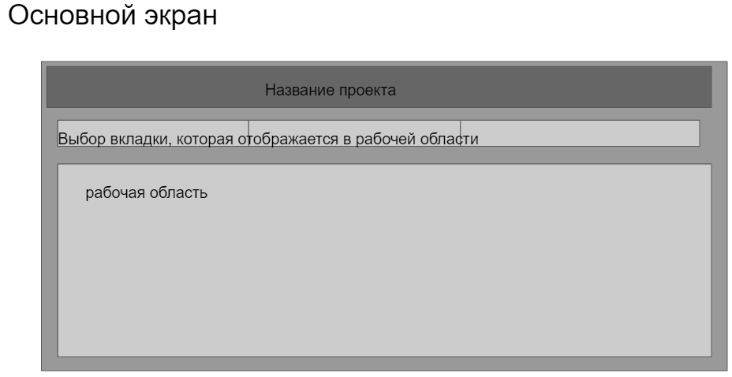
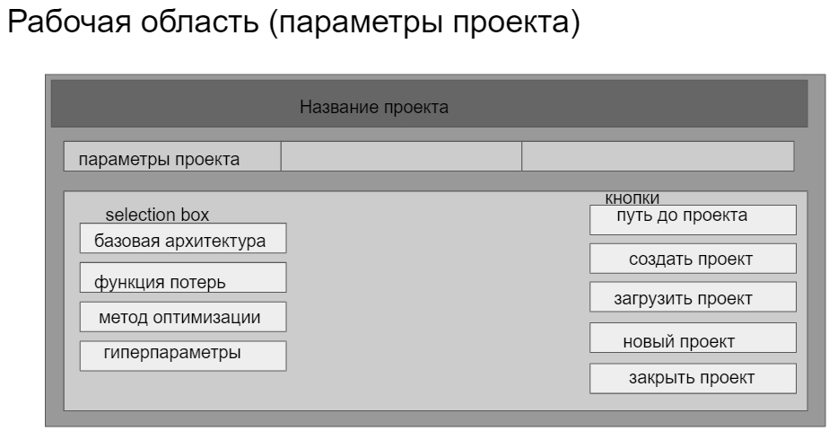
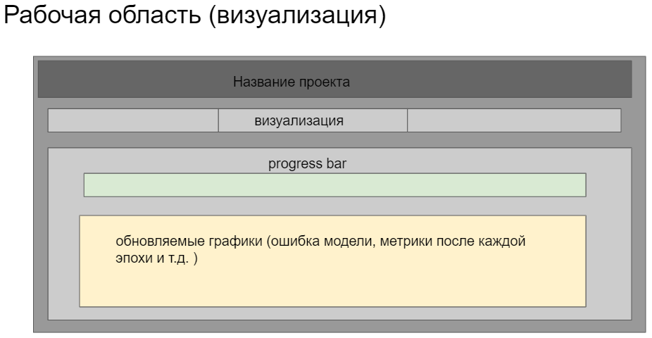
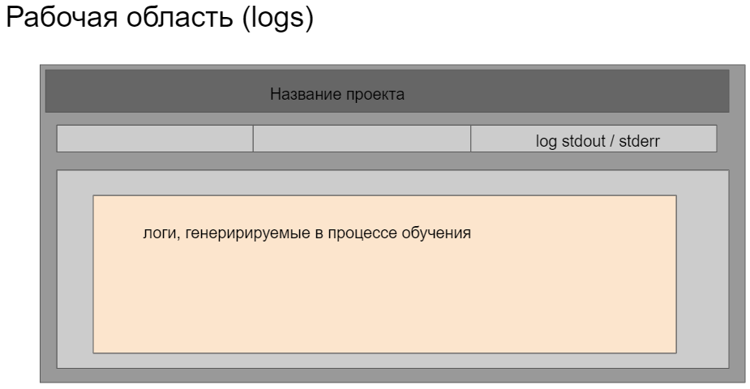

# GraphicalCNN

Python==3.9.2

Реализовать удобный графический пользовательский интерфейс для обучения нейронных моделей
классификации и сегментации изображений с использованием фреймворка глубокого
обучения PyTorch.

Пользователю даётся возможность задавать желаемые функции потерь, конфигурацию архитектуры
и прочие гиперпараметры требуемые для обучения свёрточных моделей.
Графический интерфейс должен предоставлять возможность контролировать ход обучения, например
через графическое отображение кривых выбранных функций потерь.

## Интерфейсная модель

## Программные возможности
* выбор базовой архитектуры (англ. backbone architecture), например: ResNet, MobileNet, DenseNet и др.;
* выбор целевой функции потерь, например: L2, CrossEntropy;
* выбор метода оптимизации модели, например; ADAM, RMSProp, AdaGrad, SGD;
* число эпох обучения, размер подаваемого в сеть пакета изображений (англ. batch size)
и прочие гиперпараметры для обучения свёрточных моделей.

## Фреймворки
* Графический интерфейс: TkInter;
* Обучение глубоких нейронных сетей: PyTorch;
* Работа с изображениями: OpenCV, NumPy;
* Анализаторы качества кода: flake8, pydocstyle.
